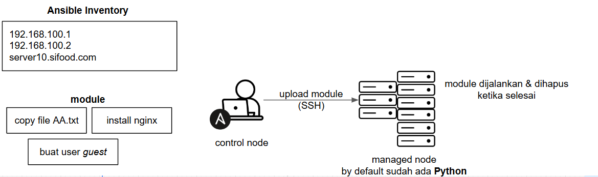

# permasalahan
- saat kita ingin melakukan konfigurasi server terkhususnya server linux, kita akan melakukan remote server melalui ssh
  - lalu melakukan task yang ingin kita kerjakan, hal ini sangat umum dilakukan
- sekarang bayangkan jika ada 100 server dan kita ingin melakukan konfigurasi yang sama,
  - ada beberapa permasalahan yang mungkin kita temui
    - capek/pegel/mual
    - ada perintah command yang terlewat
    - perintah yang dijalankan tidak terdokumentasi dengan baik

# pengenalan ansible
- ansible adalah tools untuk mengautomatisasi tugas tugas IT
  - seperti membuat & mengkonfigurasi resource di cloud, linux, windows, database, dll
  - namun pada materi kali ini kita akan fokus dari penggunaan ansible untuk linux
- kelebihan ansible adalah dia sifatnya agent-le, yang dimana kita tidak perlu menginstall agent di setiap server yang ingin di automisasi
  - cukup install ansible di komputer / laptop admin saja

## cara kerja ansible
### 1
- karena pada materi ini kita akan menggunakan linux server sebagai studikasusnya, maka kita akan bahas cara kerja untuk hal tersebut
  - untuk environment lainya seperti windows server atau cloud
  - caranya mirip cuman ada bagian yang sedikit berbeda
- tugas yang ingin kita jalankan akan dibungkus dalam sebuah module
  - setiap module menjalankan tugas kecil secara spesifik seperti copy file
  - install web server atau membuat user baru
- module ini akan di upload oleh ansible ke server tujuan, dijalankan, dan akan dihapus setelah selesai

### 2
- seperti yang kita bahas sebelumnya ansible itu agent-less
  - namun sebenernya di server linux yang akan di automatisasikan tersebut dibutuhkan python untuk menjalankan module
- ketika kita menginstall linux apapun. biasanya di dalamnya sudah tersedia python, karena di linux ada beberapa tools yang jalan menggunakan python
  - jadi kita tidak perlu menginstallnya lagi

### 3
- sekarang mungkin kita bertanya tanya bagaimana ansible tahu server mana yang perlu di konfigurasi
- di ansible ada konsep yang bernama iventory. dimana kita dapat mendefinisikan IP/domain dari server dalam suatu file
  - yang dimana nantinya ansible akan membaca file iventory tersebut sebelum membaca module

- control node => yang menjalankan ansible
- managed node => server target yang di automisasi

### 4
- dalam prakteknya biasanya kita tidak akan menjalankan 1 module,
  - tapi banyak module sekaligus
- dan biasanya module yang ingin kita jalankan itu harus berutan
  - contohnya open port 80/http terlebih dahulu 
- agar module-module tersebut dapat dijalnakan sekaligus dan beruruta,
  - nantinya module-module yang ada dapat dibungkus dengan ansible playbock