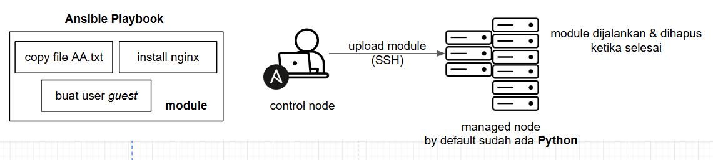
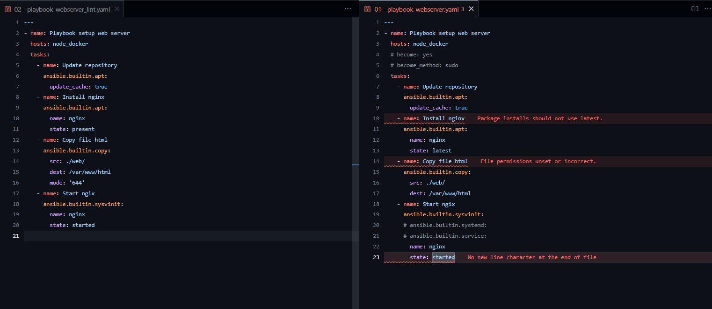

# ansible playbook
- sebelumnya saat kita ingin mengeksekusi sebuah module harus menuliskanya secara langsung di terminal ```ansible <pattern> <options>```
- dalam prakteknya kita kadang ingin menjalankan banyak module / tugas sekaligus
- untuk mengatasi masalah ini kita dapat menggunakan [ansible playbook](https://docs.ansible.com/ansible/latest/playbook_guide/playbooks_intro.html#ansible-playbooks)
  - dimana kita bisa mendefinisikan banyak module dalam satu file yaml



## webserver
```yaml
---
- name: Playbook setup web server
  hosts: node_docker
  # become: yes
  # become_method: sudo
  tasks:
    - name: Update repository
      ansible.builtin.apt:
        update_cache: true
    - name: Install nginx
      ansible.builtin.apt:
        name: nginx
        state: latest
    - name: Copy file html
      ansible.builtin.copy:
        src: ./web/
        dest: /var/www/html
    - name: Start nginx
      ansible.builtin.service:
        name: nginx
        state: started
```

- become, dan become_method => berfungsi apakah ingin menggunakan permmision dan metode nya
- untuk menjalankan task yang ada di playbook gunakan perintah ```ansible-playbook <file>```
- pastikan user yang kita definiskan di file inventory memiliki akses sudo

## run
```bash
ansible-playbook 01\ -\ playbook-webserver.yaml

nmap node1
# 80/tcp open  http

curl node1
# <h1>Test Web Aria Fatah</h1>
```

## menginstall ansible linter
- agar penulisan yaml pada ansible playbook kita sesuai dengan kaidah / standar yang ada
  - kita perlu menggunakan [ansible linter](https://ansible.readthedocs.io/projects/lint/)
  - untuk menginstallnya dapat mengikuti cara [disini](https://ansible.readthedocs.io/projects/lint/installing/#installing-the-latest-version)
- jika kita menggunakan vs code dan sudah menginstall extension ansible, vs code otomatis mendeteksi command ansible-linter
  - jika kita cek kembali file playbook sebelumnya akan ada banyak error message karena tidak sesuai dengan standar yang ditentukan

```bash
pip3 install ansible-lint
```

## memperbaiki error di playbook
- jika kita ingin gunakan kembali file tersebut hasilnya akan sama namun konfigurasi playbook kita sudah sesuai dengan standar yang ada di linter
- kita harus melihat errornya apa dan memperbaikinya secara manual

