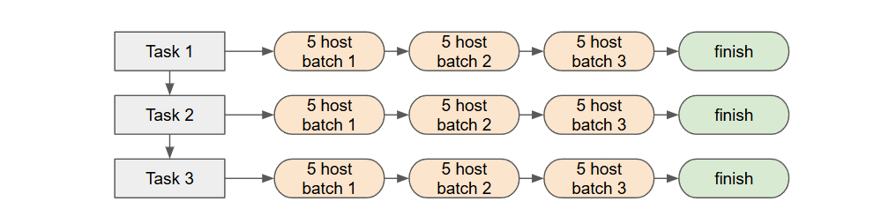

# ansible task control
## forks
- secara default ansible mengirimkan module / task secara pararel
  - pararel di ansible disebut sebagai [forks](https://docs.ansible.com/ansible/latest/playbook_guide/playbooks_strategies.html#controlling-playbook-execution-strategies-and-more),
    - dan nilai defaultnya adalah 5
  - yang artinya ansible akan mengirimkan task pertama ke 5 host secara pararel
  - setelah selesai akan lanjut task kedua dan begitu seterusnya



- untuk mengubah nilai dari forks kita dapat mengkonfigurasi di [ansible config](https://docs.ansible.com/ansible/latest/playbook_guide/playbooks_strategies.html#setting-the-number-of-forks)
- yang perlu diperhatikan adalah ketika menjalankan suatu secara pararel akan mengkonsumsi resource cukup besar di control node
  -  walaupun memang proses jauh lebih cepat

- ansible.cfg
```INI
[defaults]
inventory=./inventory/hosts
host_key_checking=False

forks = 30
```