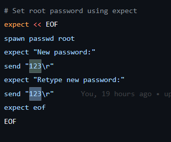
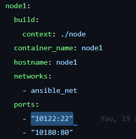

# setup
- ubah volume sesuai folder yang ingin digunakan \
  
- sesuaikan ssh_key yang ingin digunakan nantinya \
  
- ubah password nodenya \
  
- ubah port forward node nya \
  

# run
```bash
# build or start
docker-compose up -d

# setup key (only first after create container)
docker exec -it ansible bash -c "mkdir -p /ssh_node && \
ssh-keygen -t rsa -f /ssh_node/id_rsa -q -N '' && \
cp /ssh_node/id_rsa /ssh_node/private.key && \
ssh-copy-id -i /ssh_node/id_rsa.pub root@node1 && \
ssh-copy-id -i /ssh_node/id_rsa.pub root@node2 && \
ssh-copy-id -i /ssh_node/id_rsa.pub root@node3 && \
ssh-copy-id -i /ssh_node/id_rsa.pub root@node_app && \
export ANSIBLE_CONFIG=./ansible.cfg"

docker exec -it ansible bash -c "
mkdir -p /ssh_node && \
ssh-keygen -t rsa -f /ssh_node/id_rsa -q -N '' && \
cp /ssh_node/id_rsa /ssh_node/private.key && \
sshpass -p '123' ssh-copy-id -i /ssh_node/id_rsa.pub -o StrictHostKeyChecking=no -o UserKnownHostsFile=/dev/null root@node1 && \
sshpass -p '123' ssh-copy-id -i /ssh_node/id_rsa.pub -o StrictHostKeyChecking=no -o UserKnownHostsFile=/dev/null root@node2 && \
sshpass -p '123' ssh-copy-id -i /ssh_node/id_rsa.pub -o StrictHostKeyChecking=no -o UserKnownHostsFile=/dev/null root@node3 && \
sshpass -p '123' ssh-copy-id -i /ssh_node/id_rsa.pub -o StrictHostKeyChecking=no -o UserKnownHostsFile=/dev/null root@node_app && \
export ANSIBLE_CONFIG=./ansible.cfg"

docker exec -it ansible bash # ansible

# stop
docker-compose stop

# remove
docke-compose down # only stop and remove container
docker-compose down --rmi all # stop with rm the image
```