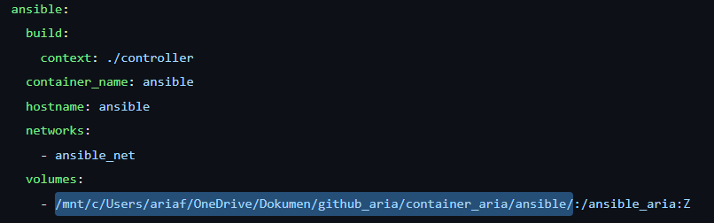
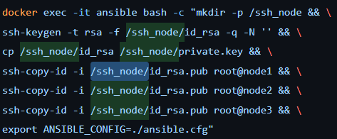

# setup
- ubah volume sesuai folder yang ingin digunakan
  
- dan sesuaikan ssh_key yang ingin digunakan nantinya
  

# run
```bash
docker compose up -d

# setup key
docker exec -it ansible bash -c "mkdir -p /ssh_node && \
ssh-keygen -t rsa -f /ssh_node/id_rsa -q -N '' && \
cp /ssh_node/id_rsa /ssh_node/private.key && \
ssh-copy-id -i /ssh_node/id_rsa.pub root@node1 && \
ssh-copy-id -i /ssh_node/id_rsa.pub root@node2 && \
ssh-copy-id -i /ssh_node/id_rsa.pub root@node3 && \
export ANSIBLE_CONFIG=./ansible.cfg"

docker exec -it ansible bash # ansible

# stop
docker compose down # only stop and remove container
docker compose down --rmi all # stop with rm the image
```