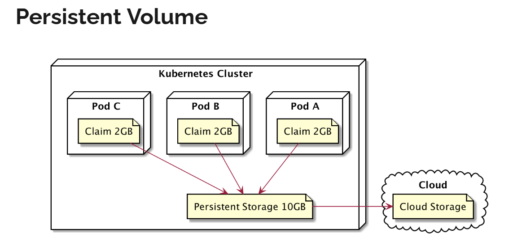

# Persistent Volume
- persistent volume sebenernya hampir mirip dengan volume
  - hanya saja cara kerjanya beda
- cara pembuatan persistent volume sedikit lebih ribet dibanding volume
  - namun ada beberapa benefit yang bisa didapatkan jika menggunakan persistent volume

## jenis jenis persistent volume
- HostPath => berkas disimpan di Node, (tidak direkoemndasikan di production, hanya untuk testing)
- GCEPersistentDisk => (GCPD => Google Cloud Persistent Disk)
- AWS ElasticBlockStore => AWS Persistent Disk
- Azure file / Azure Disk => Microsoft Azure Persistent Disk

## tahapan persistent volume
- membuat persistent volume
- membuat persistent volume Claim
- menambahkan persistent volume Claim ke Pod



## command
```bash
kubectl create -f persistentVolume.yaml

kubectl get pv
kubectl describe pv <name_pv>
kubectl get pvc # persistent volume claim
kubectl describe pvc <name_pvc>

kubectl delete pv <name_pv>
kubectl delete pvc <name_pvc>
```

## template
```yaml
apiVersion: v1
kind: PersistentVolume
metadata:
  name: persistent-volume-name
spec:
  accessModes:
    - ReadWriteOnce
  capacity:
    storage: 5Gi
  hostPath:
    path: /data/location

---

apiVersion: v1
kind: PersistentVolumeClaim
metadata:
  name: persistent-volume-claim-name
spec:
  accessModes:
    - ReadWriteOnce
  volumeMode: Filesystem
  resources:
    requests:
      storage: 1Gi
```

## example
```yaml
apiVersion: v1
kind: PersistentVolume
metadata:
  name: nodejs-writer-volume
spec:
  accessModes:
    - ReadWriteOnce
  capacity:
    storage: 5Gi
  hostPath:
    path: /data/location

---

apiVersion: v1
kind: PersistentVolumeClaim
metadata:
  name: nodejs-writer-volume-claim
spec:
  accessModes:
    - ReadWriteOnce
  volumeMode: Filesystem
  resources:
    requests:
      storage: 1Gi

---

apiVersion: v1
kind: Pod
metadata:
  name: nodejs-writer
  labels:
    name: nodejs-writer
spec:
  volumes:
    - name: html
      persistentVolumeClaim:
        claimName: nodejs-writer-volume-claim
  containers:
    - name: nodejs-writer
      image: khannedy/nodejs-writer
      volumeMounts:
        - mountPath: /app/html
          name: html
```

## run
```bash
kubectl create -f 04\ -\ persistent-volume.yaml

kubectl get -f 04\ -\ persistent-volume.yaml
kubectl exec -it nodejs-writer -- /bin/sh
/ # ls /app/html/
# index.html
```