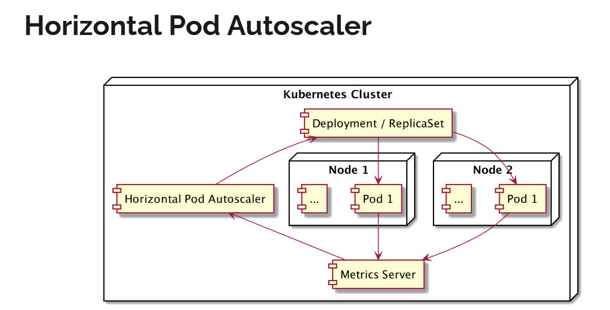

# Horizontal Pod Autoscaler
- saat aplikasi kita sedang sibuk. sehingga konsumsi memory atau cpu tinggi
  - maka ada kemungkinan performa aplikasi kita akan turun
- saat hal ini terjadi, application scaling sangat dibutuhkan
- secara garis besar ada 2 jenis application scaling
  - vertical scaling
  - horizontal scaling

## vertical scaling
- vertical scaling => adalah cara application scaling dengan cara mengupgrade computional resource di aplikasi kita
- misal dari 1 cpu menjadi 2 cpu, dari 1GB memory menjadi 2GB
- namun permasalahan vertical scaling adalah, akan ada batasnya, 
  - Pod di kubernetes tidak bisa menggunakan resource melebihi Node yang ada 

## Horizontal scaling
- Horizontal scaling => adalah application scaling dengan cara membuat Pod baru
  - agar beban pekerjaan di distribusikan ke Pod baru tersebut
- Scalability terbaik harusnya dicapai dengan Horizontal scaling.
  - karena horizontal scaling kita tidak butuh upgrade Node dengan resource yang lebih tinggi

# Vertical Pod Autoscaler
- vertical Pod autoscaler => adalah kemampuan secara otomatis application scaling secara vertical
  - dengan fitur mengupgrade resource Pod dan menurunkan secara otomatis jika diperlukan
- saat ini fitur ini masih dalam tahap development.
  - namun kita bisa memantau fitur ini dihalaman github kubernetes
    [vertical pod autoscaler](https://github.com/kubernetes/autoscaler/tree/master/vertical-pod-autoscaler)
- fitur ini sudah bisa dicoba di beberapa cloud provider seperti google cloud dan AWS
  [docs aws vertical pod autoscaler](https://docs.aws.amazon.com/eks/latest/userguide/vertical-pod-autoscaler.html)

# Horizontal Pod Autoscaler
- Horizontal Pod Autoscaler => adalah kemampuan secara otomatis application scaling secara Horizontal
  - dengan cara menambahkan Pod baru dan menurunkan secara otomatis jika diperlukan 
- Horizontal Pod Autoscaler atau disingkat HPA, merupakan object di kubernetes
- kita bisa membuat HPA dan menghapus HPA di kubernetes
- HPA bekerja dengan cara mendengarkan data metrics dari setiap Pod,
  - dan jika sudah mencapai batas tertentu, HPA akan melakukan auto scaling
    - (baik itu menaikan Pod atau menurunkan jumlah Pod)



- metric server digunakan untuk mendegarkan semua informasi dari Pod
  - penggunaan memoery, CPU, dll, dan akan melakukan report ke HPA

## syntax
```bash
minikube addons enable metrics-server
kubectl get pod --namespace kube-system
```

## template
```yaml
apiVersion: autoscaling/v2beta2
kind: HorizontalPodAutoscaler
metadata:
  name: hpa-name
spec:
  minReplicas: 3
  maxReplicas: 5
  scaleTargetRef:
    apiVersion: apps/v1
    kind: Deployment
    name: deployment-name
  metrics:
    - type: Resource
      resource:
        name: cpu
        target:
          type: Utilization
          averageUtilization: 70
    - type: Resource
      resource:
        name: memory
        target:
          type: Utilization
          averageUtilization: 70
```

## example
```yaml
apiVersion: apps/v1
kind: Deployment
metadata:
  name: nodejs-web
  labels:
    name: nodejs-web
spec:
  selector:
    matchLabels:
      name: nodejs-web
  template:
    metadata:
      name: nodejs-web
      labels:
        name: nodejs-web
    spec:
      containers:
        - name: nodejs-web
          image: khannedy/nodejs-web:1
          ports:
            - containerPort: 3000

---

apiVersion: v1
kind: Service
metadata:
  name: nodejs-web-service
spec:
  type: NodePort
  selector:
    name: nodejs-web
  ports:
    - port: 3000
      targetPort: 3000
      nodePort: 30001

---

apiVersion: autoscaling/v2
kind: HorizontalPodAutoscaler
metadata:
  name: hpa-name
spec:
  minReplicas: 3
  maxReplicas: 5
  scaleTargetRef:
    apiVersion: apps/v1
    kind: Deployment
    name: nodejs-web
  metrics:
    - type: Resource
      resource:
        name: cpu
        target:
          type: Utilization
          averageUtilization: 70
    - type: Resource
      resource:
        name: memory
        target:
          type: Utilization
          averageUtilization: 70
```

## run
```bash
kubectl create -f 07\ -\ hpa\ \(horizontal\ pod\ autoscaler\).yaml

kubectl get hpa
kubectl describe hpa <nama_hpa>
```