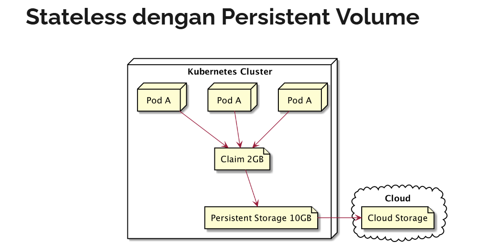
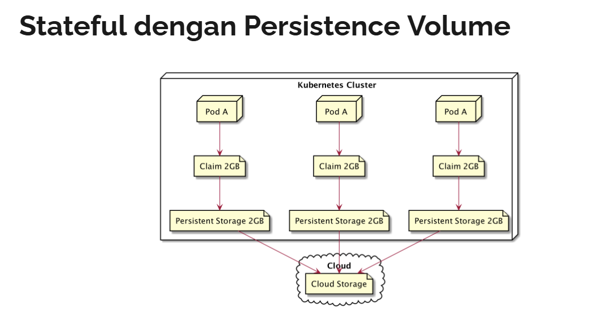

# statefulset
- Pod, ReplicationSet, ReplicationControler, Deployment, itu semua cocok digunakan untuk aplikasi jenis stateless
- stateless => artinya aplikasi kita tidak menyimpan state atau data
  - jadi jika ditengah jalan aplikasi kita dihapus dan dibuat lagi, tidak akan bermasalah
- namun bagaimana dengan aplikasi stateful? seperti contohnya database? yang harus menyimpan data? 
  - dan tidak bisa sembarangan dihapus di tengah jalan ketika kita melakukan update aplikasi

## stateless dengan persistent volume
- persistent volume tidak akan membantu jika kita memiliki aplikasi yang statefull
  - karena semua pod akan meng-claim persistent volume yang sama, dan direktori yang sama
- sedangkan jika aplikasi kita stateful, kemungkinan besar, kita ingin memiliki data yang independen tiap pod
  - walaupun jenis pod nya sama




## stateless vs stateful
- jika di ibaratkan stateless adalah hewan ternak, sedangkan stateful adalah hewan perliharaan
- dalam hewan ternak kita tidak peduli siapa yang mati, disembelih atau hilang.
  - yang penting bisa diganti hewan yang baru
- namun hewan perliharaan, jika ada satu yang sakit maka kita akan merawatnya sampai sehat, 
  - dan jika mati maka kita akan mencari hewan yang sama dengan karakteristiknya

## statefulset
- statefulset adalah object di kubernetes untuk memanage aplikasi jenis stateful
- statefulset akan memastikan bahwa nama pod yang konsisten, identitas network yang stabil, 
  - dan persistent volume yang stabil untuk tiap pod
- jika ada pod yang mati, maka statefulset akan membuat pod baru dengan nama, 
  - dan informasi yang sama pada pod yang mati

# create statefulset
- membuat statefulset sangat mudah, hanya seperti membuat RepllicaSet
- namun statefullset memiliki kemampuan untuk menambahkan volume claim template

## command
```bash
kubectl create -f statefulset.yaml
kubectl apply -f statefulset.yamll

kubectl get statefulset
kubectl describe statefulset <name_statefulset>
kubectl delete statefulset <name_statefulset>
```

## template
```yaml
apiVersion: apps/v1
kind: StatefulSet
metadata:
  name: name-stateful
  labels:
    name: name-stateful
spec:
  # https://github.com/kubernetes/kubernetes/issues/69608
  serviceName: name-stateful-service
  replicas: 3
  selector:
    matchLabels:
      name: name-stateful
  volumeClaimTemplates:
    - metadata:
        name: name-stateful-volume-claim
      spec:
        accessModes:
          - ReadWriteOnce
        volumeMode: Filesystem
        resources:
          requests:
            storage: 1Gi
  template:
    metadata:
      name: name-stateful
      labels:
        name: name-stateful
    spec:
      containers:
        - name: name-stateful
          image: image/name-stateful
          volumeMounts:
            - mountPath: /app/data
              name: name-stateful-volume-claim
```

## example
```yaml
apiVersion: v1
kind: PersistentVolume
metadata:
  name: nodejs-stateful-volume
spec:
  accessModes:
    - ReadWriteOnce
  capacity:
    storage: 5Gi
  hostPath:
    path: /data/location

---

apiVersion: apps/v1
kind: StatefulSet
metadata:
  name: nodejs-stateful
  labels:
    name: nodejs-stateful
spec:
  # https://github.com/kubernetes/kubernetes/issues/69608
  serviceName: nodejs-stateful-service
  replicas: 3
  selector:
    matchLabels:
      name: nodejs-stateful
  volumeClaimTemplates:
    - metadata:
        name: nodejs-stateful-volume-claim
      spec:
        accessModes:
          - ReadWriteOnce
        volumeMode: Filesystem
        resources:
          requests:
            storage: 1Gi
  template:
    metadata:
      name: nodejs-stateful
      labels:
        name: nodejs-stateful
    spec:
      containers:
        - name: nodejs-stateful
          image: khannedy/nodejs-stateful
          env:
            - name: POD_NAME
              valueFrom:
                fieldRef:
                  fieldPath: metadata.name
          volumeMounts:
            - mountPath: /app/data
              name: nodejs-stateful-volume-claim
```

## run
```bash
kubectl create -f statefulset.yaml

kubectl get pod
# NAME                READY   STATUS    RESTARTS     AGE
# nodejs-stateful-0   1/1     Running   0            116s
# nodejs-stateful-1   1/1     Running   0            109s
# nodejs-stateful-2   1/1     Running   0            103s

kubectl delete pod nodejs-stateful-1

kubectl get pod
# NAME                READY   STATUS              RESTARTS     AGE
# nodejs-stateful-0   1/1     Running             0            3m35s
# nodejs-stateful-1   0/1     ContainerCreating   0            3s
# nodejs-stateful-2   1/1     Running             0            3m22s
```