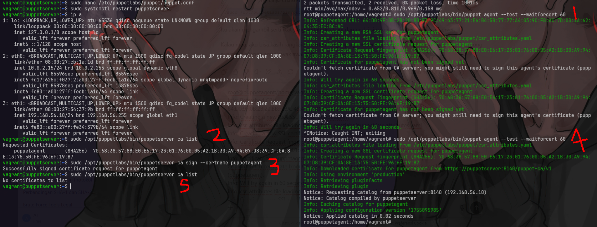

# puppet
## setup
```bash
vagrant up
```

### 1. enable puppet agent
```bash
sudo tee /etc/puppetlabs/puppet/puppet.conf > /dev/null << EOF
[main]
server = puppetserver
certname = puppetagent
environment = production
runinterval = 1h
EOF
/opt/puppetlabs/bin/puppet resource service puppet ensure=running enable=true
```
tambahkan ip puppet server ke dalam /etc/hosts
```bash
echo "192.168.56.10 puppetserver" >> /etc/hosts
ping puppetserver
```

### 2. Konfigurasi Puppet Server
```vagrant ssh puppetserver```
```sudo nano /etc/puppetlabs/puppet/puppet.conf```
tambahkan
```bash
[main]
dns_alt_names = puppet,puppetserver
certname = puppetserver
server = puppetserver
environment = production
```
Lalu restart:
```bash
sudo systemctl restart puppetserver
```

### 3. Konfigurasi Puppet Agent
```vagrant ssh puppetagent```
<!-- ```sudo nano /etc/puppetlabs/puppet/puppet.conf```
Tambahkan:
```bash
[main]
server = puppetserver
certname = puppetagent
environment = production
``` -->
Lalu minta sertifikat:
```bash
sudo /opt/puppetlabs/bin/puppet agent --test --waitforcert 60
```

## Sign sertifikat di Puppet Server
```bash
sudo /opt/puppetlabs/bin/puppetserver ca list
sudo /opt/puppetlabs/bin/puppetserver ca sign --certname puppetagent
```



## manifest
## 1. Buat manifest untuk install web server & clone repo
```bash
sudo tee /etc/puppetlabs/code/environments/production/manifests/site.pp > /dev/null << EOF
node 'puppetagent' {
  package { 'apache2':
    ensure => installed,
  }

  service { 'apache2':
    ensure => running,
    enable => true,
  }

  exec { 'clone website':
    command => '/usr/bin/git clone https://github.com/ariafatah0711/linktree /var/www/html',
    creates => '/var/www/html/index.html',
    require => Package['apache2'],
  }
}
EOF

sudo chown puppet:puppet /etc/puppetlabs/code/environments/production/manifests/site.pp
```

## 2. jalankan di puppetagent
```bash
sudo /opt/puppetlabs/bin/puppet agent --test
# Kalau sertifikat agent belum disign, lakukan sign di server dulu (kayak langkah sebelumnya):
```

